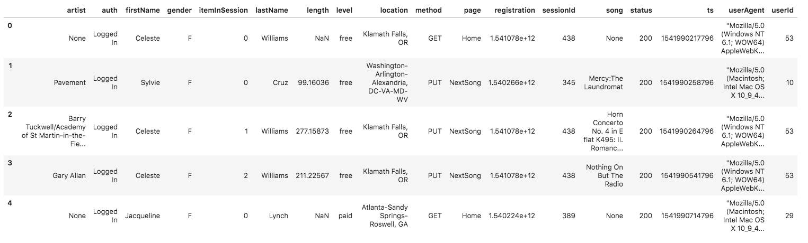
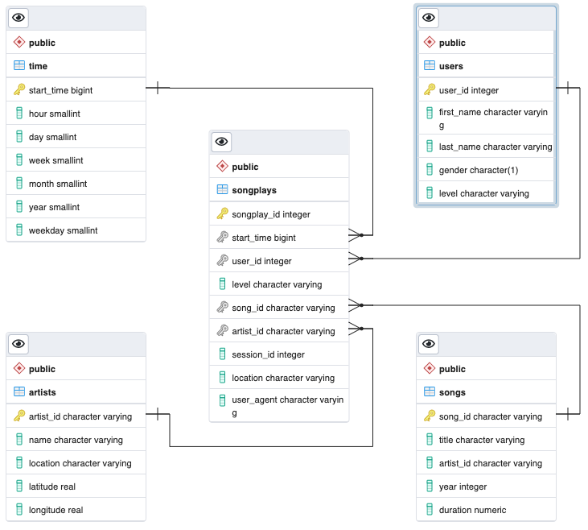

## Data Modeling with Postgres

### Introduction
A fictitious music streaming service called Sparkify has been collecting data on songs and user activity on their
music streaming app, and is interested in understanding what songs their users are listening to.
As this data is currently stored in a directory containing JSON files, their analytics team has no easy
way to query the information they need. They would like a data engineer to create a Postgres database with tables
designed to optimize queries on song play analysis, and write an ETL pipeline that transfers the data from JSON
files into these tables.

### Understanding the Data
The metadata on songs is stored in the `data/song_data` directory, and it contains JSON files of the form:
`{"num_songs": 1, "artist_id": "ARJIE2Y1187B994AB7", "artist_latitude": null, "artist_longitude": null,
"artist_location": "", "artist_name": "Line Renaud", "song_id": "SOUPIRU12A6D4FA1E1", "title": "Der Kleine Dompfaff",
"duration": 152.92036, "year": 0}`. The files in this directory are partitioned by the first three letters of each
song's track ID. For example, a filepath to one file looks like this: `song_data/A/B/C/TRABCEI128F424C983.json`

### Schema Design
For this simple dataset, going ahead with a ***Star Schema*** seems to be a good choice for solving our song play
analysis problem. To create a Star Schema, we need a Fact table, and a few Dimension Tables, which are as shown below:

The `songplays` table is the Fact table, while the others are the Dimension tables in our schema. The Fact table
contains the details from the user activity log files, which are the focus of our analysis. Details corresponding to
individual entities such as songs, artists, users, and time are contained in their respective Dimension tables. This
schema allows us to fetch the data we need using simple queries without requiring joins on multiple tables.

### ETL Pipeline

Before running the ETL pipeline, we first need to create our database, and the tables inside it. `create_tables.py`
does exactly that. It drops the existing database or tables and then runs the creation statements. All the queries
used by this script, and the other scripts are contained inside `sql_queries.py`.

`etl.py` is the script for our ETL pipeline. It contains two functions - `process_log_file` and `process_song_file`,
which are responsible for processing a single JSON file containing the user activity logs and song metadata
respectively. After creating the database schema, we first populate our Dimension tables. The data inside the _songs_
and the _artists_ tables is extracted from the songs metadata JSON files, while the data inside the _time_ and _users_
tables is extracted from the activity log files. The activity log files also contain the data for our _songplays_ table.
Appropriate comments inside the code give a nice understanding of the ETL process.

To put it all together, this is how the various scripts should be executed inside the terminal:
1. Run `python create_tables.py`, to create the database and the tables.
2. Run `python etl.py` to process our dataset, and populate our tables.
3. Now the database is ready for running our queries for analysis.

### Tools Used
1. Postgres Database
2. SQL
3. Python3
4. psycopg2 - Postgres database driver for python
5. pandas - Reading and operating on JSON data
